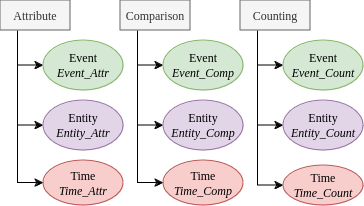

<span align="center">
    <a href="https://huggingface.co/datasets/DataScienceUIBK/ComplexTempQA/tree/main">
          <a href="https://arxiv.org/abs/2406.04866"></a>
    <a href="https://creativecommons.org/publicdomain/zero/1.0/deed.en"></a>
</span>

# ComplexTempQA

## Overview

This repository contains a large-scale temporal question answering dataset designed for evaluating and training language models on temporal reasoning tasks. The dataset consists of question-answer pairs with a focus on temporal aspects, covering a wide range of events and entities from 1987 to 2023.

<p align="center">

</p>

## Dataset Description

- **Size**: The dataset comprises **100,228,457** question-answer pairs, making it one of the largest temporal question answering datasets available.
- **Question Types**: Questions are categorized based on their complexity, including easy and hard questions, each designed to test different levels of temporal reasoning and understanding.
- **Content**: The dataset covers a diverse range of events and entities, sourced from Wikipedia and Wikidata, ensuring a rich and varied set of questions for evaluation.
- **Metadata**: Each question-answer pair includes additional metadata, such as entity/event IDs, question difficulty ratings, and temporal attributes, providing valuable information for analysis and model evaluation.

## Dataset distribution

<p align="left">

</p>


| **Name**               | **Total**       |
|------------------------|----------------|
| Attribute Event        | 83,798         |
| Attribute Entity       | 84,079         |
| Attribute Time         | 9,454          |
| Comparison Event       | 25,353,340     |
| Comparison Entity      | 74,678,117     |
| Comparison Time        | 54,022,952     |
| Counting Event        | 18,325         |
| Counting Entity       | 10,798         |
| Counting Time         | 12,732         |
| **Multi-Hop:**         | 76,933         |
| **Unnamed Event:**     | 8,707,123      |
| **Total:**            | **100,228,457** |

## Evaluation and Usage

- **Performance Evaluation**: The dataset can be used to evaluate the performance of language models on temporal reasoning tasks, including across-time comparison, event/entity detection, and multi-hop reasoning.
- **Fine-Tuning**: Researchers can leverage this dataset for fine-tuning language models, enhancing their temporal reasoning capabilities and performance on similar tasks.

## Dataset

- **Download**: The dataset is available at [Hugging Face](https://huggingface.co/datasets/DataScienceUIBK/ComplexTempQA)
- **Testing Dataset**: A small version for testing purpose is available [here](./ComplexTempQA_small.json)


## Question Generation

This project contains Python scripts designed to generate various types of questions based on event data. The scripts read event attributes from a database, construct questions, and store them back in the database.
<p align="center">

</p>

### Requirements

- Python 3.x
- `psycopg2` for PostgreSQL database interaction
- `requests` for HTTP requests
- `configparser` for reading database configuration
- `SPARQLWrapper` for executing SPARQL queries

### Setup

1. Clone the repository:
   ```bash
   git clone <repository_url>
   cd <repository_folder>
2. Install the required Python packages:
   ```bash
   pip install psycopg2 configparser pandas
3. Configure the database connection:
   - Create a `database.ini` file with the following format:
     ```ini
     [postgresql]
     host=your_host
     database=your_database
     user=your_user
     password=your_password
     ```
### Running the Scripts

1. Ensure your database is set up and populated with the required data.
2. Run the question generation files for the desired type of question
